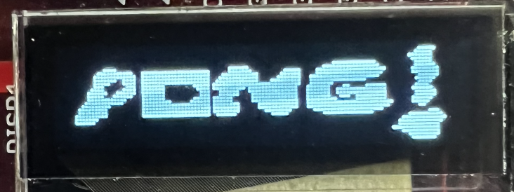
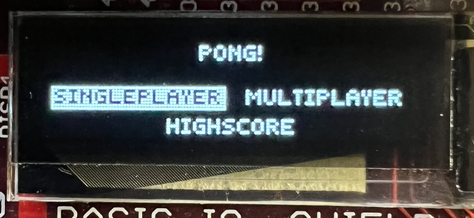
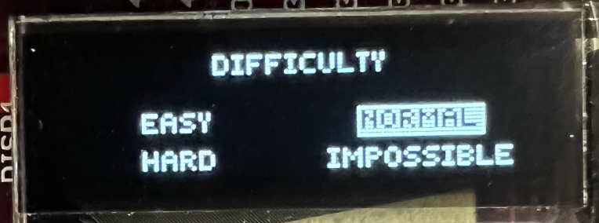
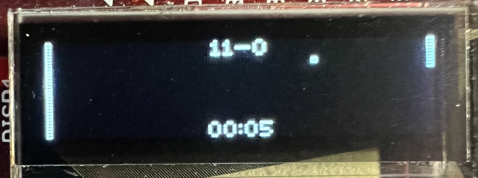
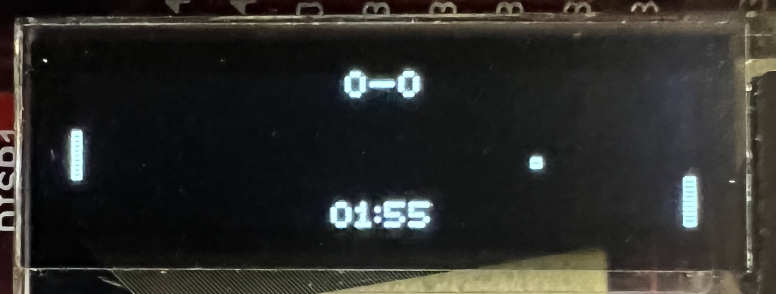
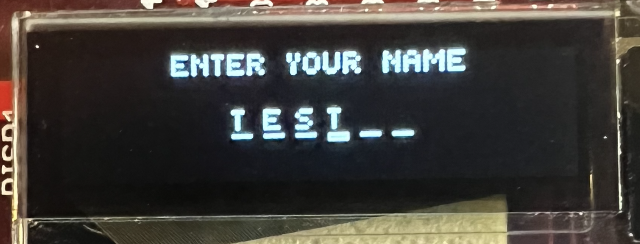
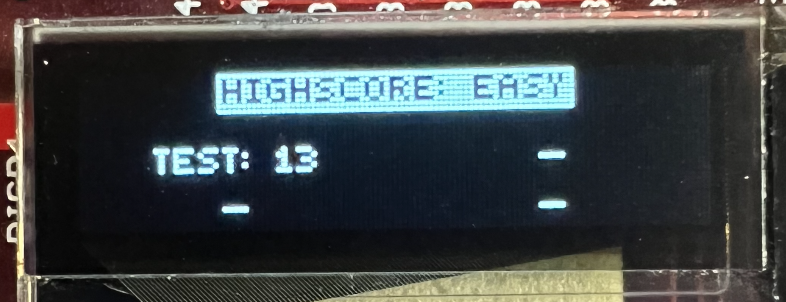

# Pong ChipKit

Written by [Alex Gunnarsson](https://github.com/alexarne) and [Marcus Nilszén](https://github.com/mebn).

Advanced project in IS1500 Datorteknik och komponenter (DTEK) at KTH 2021. Classic pong game on uno32/uc32 chipkit with IO Shield.

## Images

 
 
 
 
 
 
 

## Video Demo

[Short gif below, click on it for the full video on YouTube](https://youtu.be/LYdWxMv3mJM)

## Features

The user can initially choose to play as singleplayer or multiplayer, or view the saved highscores.

In singleplayer, the user chooses difficulty of the AI which controls the other paddle:
* EASY: The user's paddle is infinitely wide, impossible to lose, and the AI's paddle follows the ball with a delay of 20 game updates.
* NORMAL: AI's paddle follows the ball with a delay of 10 game updates.
* HARD: Once in its half of the playing field, the AI predicts where to move in order to correctly block the ball.
* IMPOSSIBLE: The AI predicts where to move in order to correctly block the ball.

In multiplayer, two sets of buttons are given to each player. 

Highscore displays the highscores for each of the singleplayer difficulties, is still saved despite the device being powered off.

In-game, the ball bounces differently depending on where it hits the paddle. The in-game timer is achieved by utilizing the hardware timer and interrupts.

If the user scores a highscore, they may input their name and save their highscore. The name is limited to 6 characters but can be less since it trims excessive spaces.

## Controls

* Home screen and Difficulty selection menu:
  * BTN4 and BTN3 navigates the menu.
  * BTN1 selects the current selection.
  * BTN2 returns to previous screen.
* Game screen (singleplayer and multiplayer)
  * BTN4 and BTN3 moves paddle 1 up and down.
  * BTN1 and BTN2 moves paddle 2 up and down.
* Enter-your-name screen
  * BTN4 and BTN3 moves between character location.
  * BTN2 and BTN1 changes letter [A-Z].
  * BTN4, when current selection is at start, exits and returns to the main menu.
  * BTN3, when current selection is at end, saves name and score to leaderboard.

* Highscore screen
  * BTN4 and BTN3 moves between difficulties leaderboard.
  * BTN2 returns to previous screen.
  * BTN1 resest all leaderboards.

## How to install on ChipKit

Before you can run this program some preparations needs to be made.

### Install mcb32tools environment

Follow the steps for your OS specified [here](https://github.com/is1200-example-projects/mcb32tools/releases/).

### Flash to chipkit (uno32/uc32)

#### Windows

1. Open MSYS terminal.
1. Find the correct serial device. Run `ls /dev` both with and without the chipkit connected to see what serial device pops up. In this case it's `ttyS2`.
1. Enter MCB32 environment: `. /opt/mcb32tools/environment`.
1. Navigate to the correct path: `cd <path>/IS1500_project`.
1. Run: `make && make install TTYDEV=/dev/ttyS2`.

#### MacOS

1. Open MCB32Tools.app.
1. Find the correct serial device. Run `ls /dev` both with and without the chipkit connected to see what serial device pops up. In this case it's `tty.usbserial-A503WFTK`.
1. Navigate to the correct path: `cd <path>/IS1500_project`.
1. Run: `make && make install TTYDEV=/dev/tty.usbserial-A503WFTK`.

## Resources

### Canvas links
https://canvas.kth.se/courses/32617/pages/literature-and-resources

### Interupts
http://ww1.microchip.com/downloads/en/DeviceDoc/61143H.pdf (p.53, table 4.4)

### Display commands
https://cdn-shop.adafruit.com/datasheets/SSD1306.pdf (p.34 for commands)

### IO Shield
https://digilent.com/reference/_media/chipkit_shield_basic_io_shield:chipkit_basic_io_shield_rm.pdf (incl. display startup procedure)

### I2C and EEPROM
* Documentation from microchip: [section 24](http://ww1.microchip.com/downloads/en/DeviceDoc/61116F.pdf) and [section 58](https://ww1.microchip.com/downloads/en/DeviceDoc/Section%2058.%20Data%20EEPROM_FRM_DS60001341E.pdf)

* [Aidanmocke.com](https://www.aidanmocke.com/blog/2018/11/27/i2c/)

* [Stackoverflow.com](https://stackoverflow.com/questions/54728534/i2c-communication-with-eeprom)

## Contributions

* New font and draw_string function: [alevarn/pic32-pong-game](https://github.com/alevarn/pic32-pong-game)

* Display, `vector.S` and `stubs.c`: [is1200/example-projects](https://github.com/is1200-example-projects/hello-display)
